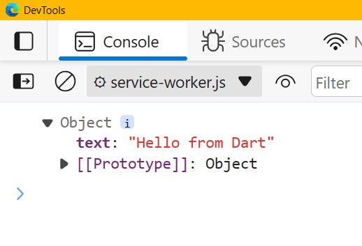

# Project name: native_messaging_host (2025 Q3 ed.)

> **NOTE**: The codebase is Windows-users oriented!

### Prerequisites

- In order to set up the native messaging host (hereinafter - "NMH") on your local machine referring to [specification](https://developer.chrome.com/docs/extensions/develop/concepts/native-messaging#native-messaging-host) that describes how to implement that;
- Load the extension on Chromium-based browser of choice (e.g. Chrome), the proof-of-case extension can be found under `./nmh-extension--unpacked/` path (directory);

### Build your executable

> Before running the command, it assumes your current working directory is `native_messaging_host` on your active terminal (_I use Git Bash for Windows, you may use complete WSL 2.0 or later_), then simply run  
`dart compile exe ./bin/main.dart -o ./bin/main.exe`; _**NOTE**: you do not need to run it from the terminal, the extension itself will_ !

### Test the NMH

1. Loead the unpacked extension, and click on your extension icon pinned to your browser's toolbar
2. Open the extension service worker console and expect the following output as shown in Figure 1 below: 

3. Build something incredible with Dart and JavaScript (Chrome Extensions), respecting the stdio limitations as described per the [specification](https://developer.chrome.com/docs/extensions/develop/concepts/native-messaging#native-messaging-host).

### Remarks

> I am not gonna lie, credits to GitHub Copilot for the guidance ❤️

Minimal robust algorithm (steps):

1. Maintain a buffer of unconsumed bytes.
2. Append each incoming chunk to that buffer.
3. While buffer length >= 4:
- Read length = getInt32(buffer[0..3], Endian.little).
- If buffer length >= 4 + length:
  - Extract payload = buffer[4 .. 4+length-1].
  - Process payload (utf8.decode -> jsonDecode).
  - Remove consumed bytes (0 .. 4+length-1) from buffer.
  - Continue loop (there may be another full frame).
- Else:
  - Break and wait for more bytes to arrive (partial payload).
4. Repeat on next chunk.

---

Made with ♥ by [projektorius96](https://github.com/projektorius96)
