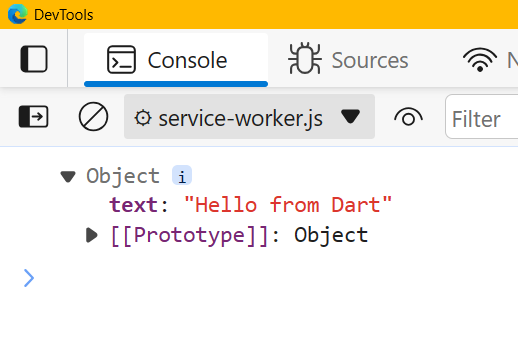

# Project name: native_messaging_host (2025 Q3 edition)

> **NOTE**: The codebase is Windows-users oriented!

### Table of contents

- [Prerequisites](#prerequisites)
- [Build your executable](#build-your-executable)
- [Testing NMH](#testing-nmh)
- [Implementation remarks](#implementation-remarks)
  - [Execution model (step-by-step)](#execution-model-step-by-step)
  - [Dart Types reference](#dart-types-reference)
- [Milestones](#milestones)

### Prerequisites

- In order to set up the native messaging host (hereinafter - "NMH") on your local machine referring to [specification](https://developer.chrome.com/docs/extensions/develop/concepts/native-messaging#native-messaging-host) that describes how to implement it;
- Load the extension on Chromium-based browser of choice (e.g. Chrome), the proof-of-case extension can be found under `./nmh-extension--unpacked/` path (directory).

### Build your executable

> Before running the command, it assumes your current working directory is `native_messaging_host` on your active terminal (_I use Git Bash for Windows, you may use complete WSL 2.0 or later_), then simply run  
`dart compile exe ./bin/main.dart -o ./bin/main.exe`; _**NOTE**: you do not need to run it from the terminal, the extension itself will_ !

### Testing NMH

1. Load the unpacked extension, and click on your extension icon pinned to your browser's toolbar
2. Open the extension service worker console and expect the following output as shown in **Figure 1**: 

3. Build something incredible with Dart and JavaScript (Chrome Extensions), respecting the stdio limitations as described in the [specification](https://developer.chrome.com/docs/extensions/develop/concepts/native-messaging#native-messaging-host).

### Implementation remarks

> I am not gonna lie, I got stuck at least once, credits to GitHub Copilot for the guidance ❤️

#### Execution model (step-by-step)

The [native messaging protocol](https://developer.chrome.com/docs/extensions/develop/concepts/native-messaging#native-messaging-host) frames every message with a 4-byte little-endian length prefix followed by a UTF-8 encoded JSON payload. `bin/main.dart` listens on `stdin`, and `lib/src/native_messaging_host_base.dart` implements the framing logic described below.

Minimal robust algorithm (steps):

1. Maintain a buffer of unconsumed bytes.
2. Append each incoming chunk to that buffer.
3. While buffer length >= 4:
- Read length = getInt32(buffer[0..3], Endian.little).
- If buffer length >= 4 + length:
  - Extract payload = buffer[4 .. 4+length-1].
  - Process payload (utf8.decode -> jsonDecode).
  - Remove consumed bytes (0 .. 4+length-1) from buffer.
  - Continue loop (there may be another full frame).
- Else:
  - Break and wait for more bytes to arrive (partial payload).
4. Repeat on next chunk.

> **NOTE**: `decodeMessage` currently assumes a single, already-complete frame is passed in (it does not itself maintain a rolling buffer across multiple `stdin` chunks); the buffering behavior above describes the general algorithm a robust caller (such as `main()`) should apply on top of it if a message can arrive split across chunks.

#### Dart Types reference

The table below maps the Dart Types/classes used throughout the implementation to their official [dart.dev API documentation](https://api.dart.dev/), for a one-to-one, easy-to-follow reference while reading the source.

| Type / class | Used in | Purpose | dart.dev API reference |
| --- | --- | --- | --- |
| `List<int>` | `bin/main.dart`, `captureStdin` | Raw bytes received from `stdin`/passed to helpers before typed conversion | [`List`](https://api.dart.dev/stable/dart-core/List-class.html) |
| `Uint8List` | `encodeMessage`, `decodeMessage`, `bin/main.dart` | Fixed-length, byte-level view over binary data (the wire format for encode/decode) | [`Uint8List`](https://api.dart.dev/stable/dart-typed_data/Uint8List-class.html) |
| `ByteData` | `encodeMessage`, `decodeMessage` (`buffer.asByteData()`) | Reads/writes fixed-width, endian-aware numeric values within a byte buffer | [`ByteData`](https://api.dart.dev/stable/dart-typed_data/ByteData-class.html) |
| `Endian` | `encodeMessage`, `decodeMessage` (`Endian.little`) | Specifies byte order (little-endian) when reading/writing the 32-bit length prefix | [`Endian`](https://api.dart.dev/stable/dart-typed_data/Endian-class.html) |
| `String` | `encodeMessage`, `decodeMessage`, `captureStdin` | Holds the UTF-8 decoded JSON text before/after (de)serialization | [`String`](https://api.dart.dev/stable/dart-core/String-class.html) |
| `Map<String, dynamic>` | `encodeMessage`, `decodeMessage`, `bin/main.dart` | Structured representation of the decoded/encoded JSON message | [`Map`](https://api.dart.dev/stable/dart-core/Map-class.html) |
| `ArgumentError` | `decodeMessage` | Thrown when the buffer is too short or the payload is incomplete | [`ArgumentError`](https://api.dart.dev/stable/dart-core/ArgumentError-class.html) |
| `IOSink` | `captureStdin` | Buffered output sink returned by `File.openWrite`, used to append log lines | [`IOSink`](https://api.dart.dev/stable/dart-io/IOSink-class.html) |
| `File` | `captureStdin` | Represents `log.jsonl` on disk, opened in append mode | [`File`](https://api.dart.dev/stable/dart-io/File-class.html) |
| `FileMode` | `captureStdin` (`FileMode.append`) | Controls how the log file is opened (append vs. write/overwrite) | [`FileMode`](https://api.dart.dev/stable/dart-io/FileMode-class.html) |
| `Stdin` | `bin/main.dart` (`io.stdin`) | Standard input stream the NMH listens on for incoming framed messages | [`Stdin`](https://api.dart.dev/stable/dart-io/Stdin-class.html) |
| `Stdout` | `bin/main.dart` (`io.stdout`) | Standard output stream used to write the framed, encoded response | [`Stdout`](https://api.dart.dev/stable/dart-io/Stdout-class.html) |
| `ProcessSignal` | `bin/main.dart` (`ProcessSignal.sigint`) | Represents OS signals (e.g. `SIGINT`) that the process listens/reacts to | [`ProcessSignal`](https://api.dart.dev/stable/dart-io/ProcessSignal-class.html) |

### Milestones

1. Write a test that temporarily would generate `./add_this_registry.reg` populating the '@=' with concrete value of the path, rather than something like `DISKVOLUME:\\PATH_TO_DART_PACKAGE_BIN_DIR\\manifest.json` as given in the initial project template; optionally, leverage [package:puppeteer](https://pub.dev/packages/puppeteer) package dependency by extracting currently tested NMH's "ID" value that would in turn replace `./bin/manifest.json` file's `YOUR_EXTENSION_GENERATED_ID` placeholder as given in the initial project template - this two-step testing process would reduce the significant amount of manual intervention by consumer or tester oneself, however for this proof-of-case scenario, it does a job as is...

---

Made with ♥ by [projektorius96](https://github.com/projektorius96) a.k.a. Lukas Gaučas